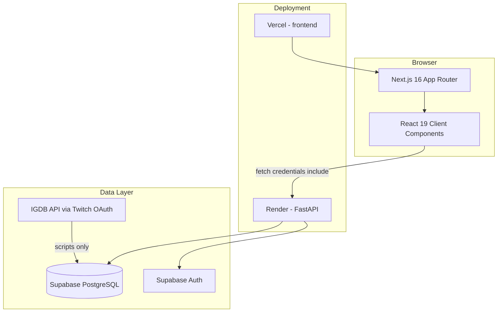
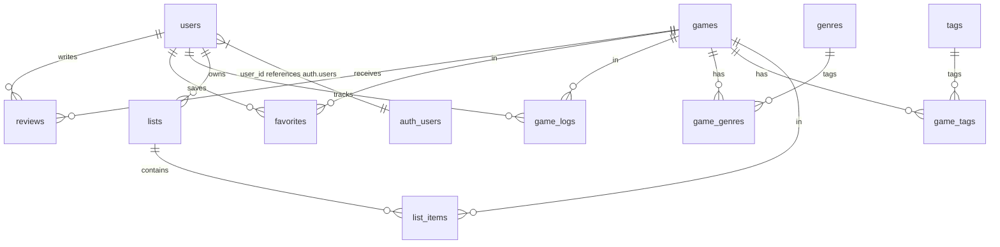

# Gameflix — Detailed Project Defense Study Guide

**Purpose:** Everything you need to understand, explain, and defend this repository. All content is based on **your actual code**, not generic tutorials.

**Companion:** [`DEFENSE_CHEAT_SHEET.md`](./DEFENSE_CHEAT_SHEET.md) — quick memorization before you walk in.

**Estimated read time:** 45–60 minutes for full study; skim section headers if you only have 15 minutes.

---

## Table of Contents

1. [Project Overview](#1-project-overview)
2. [Tech Stack (Deep Dive)](#2-tech-stack-deep-dive)
3. [Folder and File Structure](#3-folder-and-file-structure)
4. [Database Schema Explained](#4-database-schema-explained)
5. [Complete API Reference](#5-complete-api-reference)
6. [Main System Flows (Step by Step)](#6-main-system-flows-step-by-step)
7. [Important Code Walkthroughs](#7-important-code-walkthroughs)
8. [Recommendation Algorithm (Technical Deep Dive)](#8-recommendation-algorithm-technical-deep-dive)
9. [Authentication and Security](#9-authentication-and-security)
10. [Data Pipeline (IGDB → Supabase)](#10-data-pipeline-igdb--supabase)
11. [Programming Concepts (With Your Examples)](#11-programming-concepts-with-your-examples)
12. [Defense Q&A (Extended)](#12-defense-qa-extended)
13. [5-Minute Presentation Script](#13-5-minute-presentation-script)
14. [1-Minute Emergency Script](#14-1-minute-emergency-script)
15. [Local Development Quick Reference](#15-local-development-quick-reference)
16. [Final Reviewer Notes](#16-final-reviewer-notes)

---

## 1. Project Overview

### 1.1 What is Gameflix?

**Gameflix** is a **full-stack web application** for video game discovery and personal tracking. The user interface brands the experience as **Vault** (logo and CSS variables like `--vault-purple`, `--vault-bg`).

At a high level, the system does four things:

1. **Discover** — Browse and search a catalog of games with genres, ratings, and cover art.
2. **Track** — Log play status (playing, completed, wishlist, etc.) in a personal **Journal**.
3. **Review** — Rate games 1–5 stars and write text reviews visible on the landing page and profile.
4. **Recommend** — Suggest games based on the user’s favorites, logs, and review history.

### 1.2 What problem does it solve?

| Problem today | How Gameflix addresses it |
|---------------|---------------------------|
| Game info is scattered across stores and wikis | One **catalog** with search, filters, and detail pages |
| Tracking play history in notes or spreadsheets | Structured **game_logs** with allowed statuses |
| No personalized “what should I play next?” | **Recommender** scores games by genre/tag overlap |
| Reviews only on commercial platforms | Community **recent reviews** on landing + per-user reviews |

### 1.3 Intended users

| User | Goals | Features they use |
|------|-------|-------------------|
| **Guest (not logged in)** | Browse, read reviews | Landing, Catalog, Game details |
| **Registered user** | Track library, get recommendations | Journal, Profile, Favorites, Recommendations |
| **Developers / panel** | Evaluate architecture | FastAPI `/docs`, migrations, repo structure |

### 1.4 Feature inventory (honest status)

| Feature | Status | Primary files |
|---------|--------|-----------------|
| Landing page (6 popular games + 4 recent reviews) | **Done** | `frontend/app/landingPage/page.tsx` |
| Catalog (search, genre, sort, pagination) | **Done** | `frontend/app/catalog/page.tsx`, `pageclient.tsx` |
| Game details by slug | **Done** | `frontend/app/catalog/games_details/page.tsx` |
| Sign up / Login / Logout | **Done** | `backend/app/routes/auth.py`, `frontend/components/login/`, `signup/` |
| Journal (CRUD logs + reviews) | **Done** | `frontend/app/Journal/page.tsx`, `hooks/useJournal.ts` |
| Profile (stats, favorites, reviews) | **Done** | `frontend/app/profile/page.tsx`, `backend/app/services/profile.py` |
| Favorites (API + game details button) | **Partial** | API complete; UI mainly on game details + profile |
| Recommendations | **Done** | `backend/app/services/recommender.py` |
| Custom lists | **Backend done, frontend minimal** | `backend/app/routes/lists.py`, `frontend/app/lists/page.tsx` |
| IGDB data import | **Done (scripts)** | `scripts/fetch_games.py`, `scripts/normalize_games.py` |

### 1.5 Typical user journeys (memorize one of each)

**Journey A — Guest browsing**

1. Open `/` → landing loads 6 popular games + 4 recent reviews.
2. Click **Catalog** → search “zelda”, filter **Adventure**, sort by **Rating**.
3. Click a game card → game details page (cover, description, genres).
4. Click **Log Journal Entry** → redirected toward Journal (login required).

**Journey B — New user**

1. **Sign up** with email, password, username.
2. Backend creates Supabase Auth user + row in `public.users`.
3. Cookies set; header shows username.
4. Open **Journal** → log a game as **playing**, rate 4 stars, write review.
5. Open **Catalog** → see **Recommended for You** section.

**Journey C — Returning user**

1. Login → cookies restored.
2. Profile shows: games logged, completed count, average rating given.
3. Edit a journal entry or delete log + review.

---

## 2. Tech Stack (Deep Dive)

### 2.1 Architecture diagram



### 2.2 Frontend stack

| Package | Version | Role in *your* project |
|---------|---------|----------------------|
| `next` | 16.2.x | Routing, SSR for catalog, `next/image` for covers |
| `react` / `react-dom` | 19.2.x | UI, hooks (`useState`, `useEffect`, `useMemo`) |
| `typescript` | 5.x | Types like `Game`, `GameLogWithDetails` |
| `tailwindcss` | 4.x | Utility styling + CSS variables for Vault theme |
| `@supabase/supabase-js` | 2.x | Installed; **main app flow uses FastAPI**, not direct browser Supabase for features |
| `lucide-react` | — | Icons on Journal page |
| `@fortawesome/react-fontawesome` | — | Star icon on catalog `GameCard` |

**Next.js patterns you use:**

| Pattern | Where | Why |
|---------|-------|-----|
| **Server Component** | `catalog/page.tsx`, `games_details/page.tsx` | Fetch data before HTML is sent |
| **Client Component** (`"use client"`) | `pageclient.tsx`, Journal, profile, landing | Interactivity, `useState`, browser APIs |
| **`dynamic = "force-dynamic"`** | `catalog/page.tsx` | Never cache catalog; always fresh data |
| **`useSyncExternalStore`** | `pageclient.tsx` | Avoid hydration mismatch on pagination buttons |

**`next.config.ts` highlights:**

- `images.remotePatterns` allows `images.igdb.com` (game covers).
- `images.unoptimized: true` — simplifies deployment (no Image Optimization API required).

### 2.3 Backend stack

| Piece | Role |
|-------|------|
| **FastAPI** | HTTP API, route modules, dependency injection (`Depends(get_auth_context)`) |
| **Uvicorn** | ASGI server — local: `uvicorn app.main:app --reload --port 8000` |
| **Pydantic schemas** | `backend/app/schemas/*` — validate request bodies (login, reviews, logs) |
| **Supabase Python SDK** | Query tables; `supabase_admin` vs user-scoped client |
| **pytest** | `backend/tests/test_auth.py`, `test_review_schema.py` |

### 2.4 Database and external services

| Service | Used for |
|---------|----------|
| **Supabase Postgres** | All app tables (`games`, `users`, `reviews`, …) |
| **Supabase Auth** | `auth.users` — email/password; JWT access + refresh tokens |
| **IGDB** | Bulk game metadata via Twitch client credentials |

### 2.5 Deployment topology

| Environment variable (frontend) | Example | Meaning |
|------------------------------|---------|---------|
| `NEXT_PUBLIC_API_URL` | `https://your-api.onrender.com` | All `lib/api.ts` calls go here |
| `NEXT_PUBLIC_SUPABASE_URL` | Supabase project URL | Legacy/direct client if used |

| Environment variable (backend) | Example | Meaning |
|-------------------------------|---------|---------|
| `SUPABASE_URL` | Project URL | Backend Supabase client |
| `SUPABASE_ANON_KEY` | Public anon key | User-scoped queries |
| `SUPABASE_SERVICE_ROLE_KEY` | Secret | Admin: signup profile insert, delete user on rollback |
| `FRONTEND_ORIGINS` | `https://app.vercel.app` | CORS allowed origins (comma-separated) |
| `COOKIE_SECURE` | `true` in prod | Cookies only over HTTPS |
| `COOKIE_SAMESITE` | `none` in prod cross-site | Allows Vercel → Render cookie auth |

`frontend/package.json` runs `postbuild`: `vercel-root-manifest-workaround.mjs` — deployment fix for Next.js manifest on Vercel.

### 2.6 Why this stack (defense talking points)

- **Separation of concerns:** UI does not embed SQL; API enforces auth and business rules.
- **Supabase Auth:** Avoid building password hashing, token refresh from scratch.
- **FastAPI `/docs`:** Live OpenAPI UI for demos — `http://localhost:8000/docs`.
- **Next.js server preload:** Catalog first paint without waiting for client JS hydration to fetch.

---

## 3. Folder and File Structure

### 3.1 Repository map (defense-relevant)

```
126-final-project/
├── frontend/                    # Next.js application
│   ├── app/                     # Routes (URL = folder structure)
│   │   ├── page.tsx             # / → LandingPage
│   │   ├── layout.tsx           # Root: globals.css + AppShell
│   │   ├── globals.css          # Vault theme CSS variables
│   │   ├── landingPage/page.tsx # Marketing home (client)
│   │   ├── catalog/
│   │   │   ├── page.tsx         # Server: preload games + genres
│   │   │   ├── pageclient.tsx   # Client: search/filter/pagination
│   │   │   └── games_details/
│   │   │       ├── page.tsx           # Server: game by slug
│   │   │       └── GameDetailsActions.tsx  # Favorite + link to Journal
│   │   ├── Journal/page.tsx     # Journal UI (client, auth-gated)
│   │   ├── profile/page.tsx     # Profile (client, auth-gated)
│   │   ├── lists/page.tsx       # Stub: auth check only
│   │   ├── login/page.tsx       # LoginForm
│   │   └── signup/page.tsx      # SignupForm
│   ├── components/
│   │   ├── layout/              # Header, Footer, AppShell
│   │   ├── catalog/             # GameCard, GameCardCatalog, Searchbar
│   │   ├── Journal/             # JournalEntryCard, JournalEntryForm
│   │   ├── profile/             # profileSummary, profileFavorites, etc.
│   │   ├── login/ signup/       # Auth forms (shadcn/ui)
│   │   └── ui/                  # button, card, input (shadcn)
│   ├── hooks/useJournal.ts      # Journal data loading hook
│   ├── lib/
│   │   ├── api.ts               # ★ Central HTTP client
│   │   ├── auth.ts              # login(), signup()
│   │   ├── formatGenre.ts       # Display labels for genre names
│   │   └── types/profile.ts     # ProfileResponse type
│   ├── types/journal.ts         # GameLog, GameLogWithDetails types
│   └── next.config.ts
├── backend/
│   └── app/
│       ├── main.py              # ★ App entry, CORS, routers
│       ├── core/
│       │   ├── config.py        # Env vars + validation
│       │   └── security.py      # Cookie set/clear
│       ├── database/
│       │   └── supabase_client_backend.py  # admin + public clients
│       ├── routes/              # One file per resource
│       ├── services/
│       │   ├── recommender.py   # ★ Recommendation engine
│       │   └── profile.py       # Profile aggregation
│       ├── schemas/             # Pydantic request/response models
│       └── utils/auth.py        # get_auth_context dependency
├── supabase/migrations/
│   └── 001_create_tables.sql    # ★ Full schema
├── scripts/
│   ├── fetch_games.py           # IGDB → games_raw.json
│   └── normalize_games.py       # JSON → Supabase tables
├── data/raw/games_raw.json      # Cached IGDB export
└── docs/
    ├── setup-guide.md           # Local dev instructions
    ├── DEFENSE_STUDY_GUIDE.md   # This file
    └── DEFENSE_CHEAT_SHEET.md
```

### 3.2 How layers connect (numbered)

1. **User action** in browser (click, type, submit form).
2. **React event handler** updates state or calls `getGames()` / `request()` from `lib/api.ts`.
3. **HTTP request** to `NEXT_PUBLIC_API_URL` + path (e.g. `/games?q=zelda`).
4. **FastAPI router** receives request; optional `Depends(get_auth_context)` for protected routes.
5. **Supabase client** runs `.table(...).select(...).execute()`.
6. **JSON response** returned; frontend updates state and re-renders UI.

### 3.3 Server vs client components (important for panel)

| File | Type | Can use hooks? | Fetches data how? |
|------|------|----------------|-------------------|
| `catalog/page.tsx` | Server | No | `await getGames()` at build/request time |
| `catalog/pageclient.tsx` | Client | Yes | `useEffect` + `getGames()` on filter change |
| `landingPage/page.tsx` | Client | Yes | `useEffect` on mount |
| `games_details/page.tsx` | Server | No | `await getGameBySlug(slug)` |

**Why both server and client fetch catalog data?**

- **Server:** Faster first paint — HTML already contains game list.
- **Client:** User interactions (search, filter) must refetch without full page reload.

---

## 4. Database Schema Explained

Source: `supabase/migrations/001_create_tables.sql`

### 4.1 Entity relationship (conceptual)



### 4.2 Table-by-table breakdown

#### `users`

| Column | Type | Notes |
|--------|------|-------|
| `user_id` | UUID PK | **Same ID as** `auth.users(id)` — links Supabase Auth to app profile |
| `username` | text UNIQUE | Shown in header and reviews |
| `email` | text UNIQUE | Also stored in Auth |
| `role` | text | Default `'user'` |

**Defense line:** “We extend Supabase Auth with an app-specific profile table for username and app data.”

#### `games`

| Column | Purpose |
|--------|---------|
| `igdb_id` | External ID from IGDB (unique) |
| `title`, `description`, `release_year` | Display on catalog/details |
| `external_rating` | IGDB/critic-style score (used ÷10 in UI sometimes) |
| `avg_user_rating` | Aggregated from user reviews |
| `cover_image` | URL (often `images.igdb.com`) |
| `slug` | URL-friendly identifier for `/catalog/games_details` |

**Indexes:** `title`, `release_year`, ratings — speed up sorting/filtering.

#### `genres` + `game_genres`

Many-to-many: one game has many genres; one genre applies to many games. Used in catalog genre filter and recommender.

#### `tags` + `game_tags`

Similar to genres; recommender uses tags with weight `TAG_WEIGHT = 1.0` (genres weighted `2.0`).

#### `reviews`

| Constraint | Meaning |
|------------|---------|
| `rating` CHECK 1–5 | Star ratings only |
| UNIQUE `(user_id, game_id)` | One review per user per game |
| `likes` | Column exists (default 0); social feature ready |

#### `favorites`

UNIQUE `(user_id, game_id)` — duplicate favorite prevented at DB level.

#### `game_logs` (Journal “status”)

| `status` value | Meaning |
|----------------|---------|
| `played` | Tried it |
| `playing` | Currently playing |
| `completed` | Finished |
| `dropped` | Stopped — recommender treats as **negative** weight (-4) |
| `wishlist` | Want to play |

UNIQUE `(user_id, game_id)` — one log row per game per user; updates use **upsert**.

#### `lists` + `list_items`

User-created collections; `is_public` controls visibility. Backend has full CRUD; frontend lists page not fully built.

### 4.3 What the panel might ask about SQL

- **Why UUID primary keys?** Globally unique, safe when merging data from IGDB imports.
- **Why `ON DELETE CASCADE`?** Deleting a user removes their reviews, logs, favorites — no orphan rows.
- **Where is `avg_user_rating` updated?** Likely in review insert/update logic or DB trigger — check review routes; if not automatic, mention as future improvement.

---

## 5. Complete API Reference

Base URL: `NEXT_PUBLIC_API_URL` (local: `http://localhost:8000`)

Interactive docs: **`GET /docs`** (Swagger UI)

### 5.1 Auth — prefix `/auth`

| Method | Path | Auth | Body / notes | Response |
|--------|------|------|--------------|----------|
| POST | `/auth/login` | No | `{ email, password }` | Sets cookies; `{ id, email, username }` |
| POST | `/auth/signup` | No | `{ email, password, username }` | Creates Auth user + `users` row; sets cookies if session exists |
| POST | `/auth/logout` | No | — | Clears cookies |
| GET | `/auth/me` | Cookie/Bearer | — | Current user profile |
| POST | `/auth/refresh` | Cookie | Uses `refresh_token` cookie | New tokens in cookies |

**Signup rollback:** If `users` insert fails, `supabase_admin.auth.admin.delete_user()` removes the Auth user.

### 5.2 Games — prefix `/games`

| Method | Path | Auth | Query params |
|--------|------|------|--------------|
| GET | `/games` | No | `limit` (1–100), `offset`, `q`, `genres` (comma-separated), `sort` (`popularity`\|`rating`\|`newest`\|`title`) |
| GET | `/games/search` | No | `q` (required), `limit` |
| GET | `/games/slug/{slug}` | No | — |
| GET | `/games/{game_id}` | No | UUID |
| GET | `/games/igdb/{igdb_id}` | No | — |

**Response shape (list):**

```json
{
  "count": 150,
  "games": [
    {
      "game_id": "...",
      "title": "...",
      "genres": ["Adventure", "RPG"],
      "avg_user_rating": 4.2,
      "external_rating": 85.5,
      "slug": "some-game",
      ...
    }
  ]
}
```

**Implementation note:** `_get_games_response()` loads **all games** from Supabase, filters and sorts in Python, then slices `[offset:offset+limit]`. Know this for scalability questions.

### 5.3 Genres — prefix `/genres`

| Method | Path | Returns |
|--------|------|---------|
| GET | `/genres` | `{ "genres": [{ "genre_id", "name" }, ...] }` |

### 5.4 Reviews — prefix `/reviews`

| Method | Path | Auth |
|--------|------|------|
| GET | `/reviews/recent` | No — landing page (limit 1–12) |
| GET | `/reviews/me` | Yes — all my reviews |
| GET | `/reviews/{game_id}` | Yes — my review for one game |
| GET | `/reviews/game/{game_id}` | No — all reviews for a game |
| POST | `/reviews` | Yes — 409 if duplicate |
| PATCH | `/reviews/{game_id}` | Yes |
| DELETE | `/reviews/{game_id}` | Yes |

### 5.5 Logs — prefix `/logs`

| Method | Path | Auth | Notes |
|--------|------|------|-------|
| GET | `/logs` | Yes | All logs for user, newest first |
| GET | `/logs/status/{status}` | Yes | Filter by status |
| GET | `/logs/{game_id}` | Yes | One log |
| POST | `/logs` | Yes | **Upsert** on `(user_id, game_id)` |
| PATCH | `/logs/{game_id}` | Yes | Update status |
| DELETE | `/logs/{game_id}` | Yes | |

### 5.6 Favorites — prefix `/favorites`

| Method | Path | Auth |
|--------|------|------|
| GET | `/favorites` | Yes |
| GET | `/favorites/{game_id}` | Yes |
| POST | `/favorites` | Yes — idempotent if exists |
| DELETE | `/favorites/{game_id}` | Yes |

Frontend: `addFavorite(gameId)` in `lib/api.ts`; `GameDetailsActions.tsx` calls it.

### 5.7 Recommendations — prefix `/recommendations`

| Method | Path | Auth |
|--------|------|------|
| GET | `/recommendations` | **Yes** — `limit` 1–50 |

Returns `{ count, recommendations: [...] }` with optional `score`, `matched_genres`, `matched_tags`.

### 5.8 Profile — prefix `/profiles`

| Method | Path | Auth | Returns |
|--------|------|------|---------|
| GET | `/profiles/me` | Yes | `{ user, stats, favorites, recent_reviews }` |

**Stats computed in `profile.py`:**

- `logged` — count of `game_logs`
- `completed` — logs where `status == "completed"`
- `avg_rating` — mean of user’s review ratings

### 5.9 Lists — prefix `/lists` (backend complete)

| Method | Path | Notes |
|--------|------|-------|
| GET | `/lists` | My lists |
| GET | `/lists/public` | Public lists |
| GET | `/lists/{list_id}` | Readable if public or owner |
| GET | `/lists/{list_id}/games` | Games in list |
| POST | `/lists` | Create |
| POST | `/lists/{list_id}/games` | Add game |
| PATCH | `/lists/{list_id}` | Update name/description/public |
| DELETE | `/lists/{list_id}` | Delete list |
| DELETE | `/lists/{list_id}/games/{game_id}` | Remove game from list |

### 5.10 Frontend `lib/api.ts` function map

| Function | HTTP |
|----------|------|
| `request<T>(path, init?)` | Generic wrapper |
| `getGames(...)` | GET `/games?...` |
| `getGame(gameId)` | GET `/games/{id}` |
| `getGameBySlug(slug)` | GET `/games/slug/{slug}` |
| `searchGames(query)` | GET `/games/search?q=` |
| `getGenres()` | GET `/genres` |
| `getRecommendations(limit)` | GET `/recommendations` |
| `addFavorite(gameId)` | POST `/favorites` |
| `getLogs()` | GET `/logs` |
| `createLog(...)` | POST `/logs` (+ Bearer if used) |
| `updateLog(gameId, { status })` | PATCH `/logs/{id}` |
| `deleteLog(gameId)` | DELETE `/logs/{id}` |
| `getMyReview(gameId)` | GET `/reviews/{gameId}` |
| `getMyReviews()` | GET `/reviews/me` |
| `deleteReview(gameId)` | DELETE `/reviews/{gameId}` |
| `getRecentReviews(limit)` | GET `/reviews/recent` |

---

## 6. Main System Flows (Step by Step)

### 6.1 Application bootstrap

```
1. User navigates to any URL
2. layout.tsx renders <html><body><AppShell>{children}</AppShell>
3. AppShell reads pathname
   - If /login or /signup → hide Header/Footer
   - Else → show Header + Footer
4. Header calls GET /auth/me (parallel to page content)
5. Page component renders (server and/or client data fetching)
```

### 6.2 Catalog flow (detailed)

**Phase 1 — Server render (`catalog/page.tsx`)**

```
1. export const dynamic = "force-dynamic"
2. Promise.all([
     getGames(20, 0, { sort: "popularity" }),
     getGenres()
   ])
3. Pass to <CatalogClient games={...} genres={...} initial_count={...} />
```

**Phase 2 — Client hydration (`pageclient.tsx`)**

```
State: query = { search: "", genres: [], sort: "popularity", offset: 0 }

On mount:
  - GET /auth/me → setUserLoggedIn true/false
  - If logged in → GET /recommendations?limit=6

On query change (useEffect, 280ms debounce):
  - setLoading(true)
  - getGames(limit, offset, { query, genres, sort, signal })
  - setGames, setTotalCount
  - setLoading(false)
  - On error → setError(message)
  - Cleanup: abort previous request
```

**Sort options (frontend + backend must match):**

| Value | Backend behavior (simplified) |
|-------|------------------------------|
| `popularity` | Genre match count, then avg_user_rating, external_rating, title |
| `rating` | Genre match, then ratings |
| `newest` | Genre match, release_year desc, ratings |
| `title` | Genre match, alphabetical title |

**Pagination math:**

- `limit = 20` (fixed in page.tsx)
- `currentPage = floor(offset / limit) + 1`
- `totalPages = ceil(totalCount / limit)`

### 6.3 Journal save flow (detailed)

When user clicks **Log Game** in `JournalEntryForm.handleSubmit()`:

```
1. Validate selectedGame + status exist
2. If edit mode:
     PATCH /logs/{game_id} { status }
   Else:
     POST /logs { game_id, status }  → upsert in DB
3. If rating provided:
     Try POST /reviews { game_id, rating, review_text }
     If 409 "Review already exists":
       PATCH /reviews/{game_id} { rating, review_text }
4. If edit mode and rating cleared but had review:
     DELETE /reviews/{game_id}
5. onSuccess() → refresh() in useJournal → re-fetch all entries
```

**Catalog → Journal deep link:**

- Recommendation cards link to `/Journal?gameId={uuid}`
- `JournalContent` reads `searchParams.get("gameId")` → opens form with `initialGameId`
- Form calls `getGame(gameId)` to prefill title and cover

### 6.4 Login flow (detailed)

```
Frontend (login-form.tsx):
  1. preventDefault on submit
  2. login({ email, password }) → POST /auth/login
  3. window.dispatchEvent("vault-auth-changed")
  4. router.replace("/"); router.refresh()

Backend (auth.py):
  1. supabase_public.auth.sign_in_with_password(...)
  2. session.access_token, session.refresh_token
  3. set_auth_cookies(response, tokens)
  4. Fetch username from users table via supabase_admin
  5. Return { id, email, username }

Subsequent requests:
  - Browser sends cookies automatically (credentials: "include")
  - get_auth_context reads access_token cookie
  - create_user_supabase(token) attaches JWT to PostgREST
```

### 6.5 Error handling patterns

| Layer | Behavior |
|-------|----------|
| `api.ts` `request()` | Network error → throw with CORS/Render hint |
| `api.ts` | HTTP 4xx/5xx → parse `detail` from JSON, throw `Error(message)` |
| Catalog client | `catch` → `setError(err.message)` red banner |
| Journal | "Failed to load journal. Are you logged in?" |
| Profile | Redirect to `/login` on failure |
| Backend games | `httpx.HTTPError` → 503 "Start local Supabase..." |

---

## 7. Important Code Walkthroughs

### 7.1 `frontend/lib/api.ts` — the HTTP layer

**`getApiUrl()` logic:**

1. If `NEXT_PUBLIC_API_URL` is set → use it (trim trailing slash).
2. Else if `NODE_ENV === "development"` → `http://localhost:8000`.
3. Else → **throw** (forces correct Vercel config).

**`request<T>()` core behavior:**

```typescript
response = await fetch(`${API_URL}${path}`, {
  ...init,
  credentials: "include",  // sends auth cookies
  headers: {
    "Content-type": "application/json",
    ...init?.headers,
  },
});
```

- Parses JSON; on failure uses `null`.
- If `!response.ok`, extracts FastAPI `detail` string.
- Returns typed `data as T`.

**Defense tip:** Say “We centralized API calls so every feature uses the same cookie and error handling behavior.”

### 7.2 `catalog/pageclient.tsx` — state machine

**Key state variables:**

| State | Purpose |
|-------|---------|
| `query` | search + genres + sort + offset |
| `games`, `totalCount` | Current page data |
| `loading`, `error` | UX |
| `recommendations`, `recommendationMode` | personalized vs popular fallback |
| `userLoggedIn` | Show recommendation section |
| `hydrated` | Fix SSR/client mismatch on pagination |

**`getFallbackRecommendations`:** If API fails or user not logged in, sort props.games by rating and take top 6.

**`getDisplayRating`:** Prefer `avg_user_rating` if > 0; else `external_rating / 10`; else `"N/A"`.

### 7.3 `GameCard.tsx` — catalog card

- Builds link: uses `slug` for navigation to game details.
- `formatGenreLabel()` for display (e.g. capitalize, replace underscores).
- Handles IGDB cover URLs starting with `//` → prepend `https:`.

### 7.4 `useJournal.ts` — N+1 pattern (know the tradeoff)

For each log row:

1. `getGame(game_id)` 
2. `getMyReview(game_id)` (catch if no review)

**Panel question:** “Isn’t that slow?”

**Answer:** “For a student project with small journal sizes it works. Production would add a backend endpoint like `GET /logs?include=game,reviews` with a single Supabase join query.”

### 7.5 `backend/app/routes/games.py` — formatting pipeline

1. Supabase select includes nested `game_genres(genres(name))`.
2. `_genre_names()` flattens to `string[]`.
3. `_format_game()` adds `genres` key, removes `game_genres`.
4. Filter by search string in title OR genre names.
5. Filter by selected genre set (case-insensitive intersection).
6. `_sort_games()` applies sort mode.
7. Slice for pagination.

### 7.6 `GameDetailsActions.tsx` — what works vs placeholder

| UI element | Wired to API? |
|------------|---------------|
| Add to Favorites | **Yes** — `addFavorite(gameId)` |
| Log Journal Entry | **Link only** — navigates to `/Journal?gameId=` |
| Play Status dropdown | **No** — local state only (not saved until Journal) |
| Star rating | **No** — local state only |

**Honest defense line:** “Game details exposes favorites and deep-links to Journal for full logging; inline status on details is UI prep for a future save button.”

---

## 8. Recommendation Algorithm (Technical Deep Dive)

File: `backend/app/services/recommender.py`  
Entry: `GET /recommendations` → `get_recommendations_for_user(supabase, user_id, limit)`

### 8.1 High-level steps

```
1. fetch_user_activity(user_id)
   → reviews, favorites, game_logs from Supabase

2. Build game_weights map:
   - Favorite: +5 per game
   - Review rating 5→+5, 4→+3, 3→+1, else -3
   - Log status: completed +3, playing +2, wishlist/played +1, dropped -4

3. If no activity → get_cold_start_recommendations()
   → top games by avg_user_rating, external_rating

4. build_preference_profile()
   → aggregate genre_weights and tag_weights from user's games

5. fetch_candidate_games()
   → up to 500 highly rated games NOT already in user's library

6. score_candidates()
   → for each candidate: genre_score + tag_score + quality_score
   → skip if final_score <= 0

7. Return top `limit` sorted by score descending
```

### 8.2 Scoring formula (explain simply)

For each candidate game:

- **Genre score:** For each matching genre, add `(user's genre weight) × 2.0`.
- **Tag score:** Same with tags × `1.0`.
- **Quality score:** `(external_rating / 20) + avg_user_rating`.
- **Final:** Sum of the three; must be > 0 to appear.

Returned fields include `matched_genres` and `matched_tags` for transparency/debugging.

### 8.3 Frontend consumption

`pageclient.tsx`:

- Calls `getRecommendations(6)` when `userLoggedIn`.
- If empty → fallback to popular games from catalog props.
- Sets `recommendationMode` to `"personalized"` or `"popular"`.
- Cards link to Journal with `gameId` query param.

### 8.4 Sample defense answer

“Our recommender is a content-based filter, not deep learning. It learns taste from explicit signals—stars, favorites, and play status—and matches against genre and tag metadata on games the user hasn’t played yet. New users get a cold-start list of globally top-rated titles.”

---

## 9. Authentication and Security

### 9.1 Cookie configuration (`security.py`)

| Cookie | Max age | Flags |
|--------|---------|-------|
| `access_token` | 1 hour | `httponly`, `secure`, `samesite`, `path=/` |
| `refresh_token` | 30 days | Same |

**httponly:** JavaScript cannot read token → reduces XSS token theft.

### 9.2 `get_auth_context` (`utils/auth.py`)

Token resolution order:

1. Cookie `access_token`
2. Else `Authorization: Bearer ...` header
3. If none → 401

Then `create_user_supabase(token)` and `supabase.auth.get_user(token)`.

### 9.3 CSRF-style origin check (`main.py` middleware)

For `POST`, `PUT`, `PATCH`, `DELETE` when auth cookies present **and** no Bearer header:

- Require `Origin` or `Referer` to match `FRONTEND_ORIGINS`.
- Else 403 `"Invalid request origin"`.

**Why:** Cookies are sent automatically; this reduces cross-site request risk from random websites.

### 9.4 Two Supabase clients

| Client | Key | Used for |
|--------|-----|----------|
| `supabase_admin` | service_role | Signup profile insert, admin delete user, public reads that bypass RLS if configured |
| `supabase_public` | anon | Public game/review reads |
| `create_user_supabase(token)` | anon + user JWT | User-scoped inserts/selects |

### 9.5 CORS (`main.py`)

```python
CORSMiddleware(
    allow_origins=settings.FRONTEND_ORIGINS,
    allow_credentials=True,
    allow_methods=["*"],
    allow_headers=["*"],
)
```

`allow_credentials=True` is **required** for cookie auth across origins.

---

## 10. Data Pipeline (IGDB → Supabase)

### 10.1 Why scripts exist

Games are not hand-entered. The team fetches bulk metadata from **IGDB** (Internet Game Database) using **Twitch OAuth** client credentials.

### 10.2 Step 1 — `scripts/fetch_games.py`

1. Load `TWITCH_CLIENT_ID`, `TWITCH_CLIENT_SECRET` from `scripts/.env.local`.
2. `POST https://id.twitch.tv/oauth2/token` → access token.
3. Paginate IGDB API (`LIMIT = 500` per page, `SLEEP_SECONDS = 0.30` between requests).
4. Write **`data/raw/games_raw.json`**.

### 10.3 Step 2 — `scripts/normalize_games.py`

1. Read `games_raw.json`.
2. Clean titles, descriptions, release years, cover URLs.
3. Extract genres, tags (from keywords/themes/platforms).
4. Batch upsert into Supabase tables: `games`, `genres`, `game_genres`, `tags`, `game_tags`.

### 10.4 When to run

From `docs/setup-guide.md`:

- After **`npx supabase db reset`** (fresh DB).
- **Not** on every dev server start.

### 10.5 Defense answer

“Our catalog content is seeded from IGDB via Twitch API credentials. Raw JSON is cached in `data/raw/` so we can re-normalize without re-hitting IGDB.”

---

## 11. Programming Concepts (With Your Examples)

### 11.1 React components and props

**Component:** function returning JSX.  
**Props:** read-only inputs.

```tsx
// Parent catalog/page.tsx
<CatalogClient games={allGames} genres={genreRes.genres} initial_count={res.count} ... />

// Child uses props.games as initial state
const [games, setGames] = useState<Game[]>(props.games);
```

### 11.2 State (`useState`)

Mutable UI data. Example — login form:

```tsx
const [email, setEmail] = useState("")
const [password, setPassword] = useState("")
const [error, setError] = useState("")
```

### 11.3 `useEffect` — side effects after render

**Pattern 1 — fetch on mount (landing page):**

```tsx
useEffect(() => {
  let active = true;
  getGames(...).then(data => { if (active) setGames(data.games); });
  return () => { active = false; };  // cleanup prevents race on unmount
}, []);
```

**Pattern 2 — fetch when dependencies change (catalog):**

```tsx
useEffect(() => { ... }, [limit, query]);
```

**Pattern 3 — auth check (Journal):**

```tsx
useEffect(() => {
  request<AuthUser>("/auth/me").then(() => setLoggedIn(true)).catch(() => setLoggedIn(false));
}, []);
```

### 11.4 `useMemo` — expensive derived data

Journal filters entries without re-filtering on every unrelated render:

```tsx
const filteredEntries = useMemo(() => {
  if (activeFilter === "all") return entries;
  return entries.filter((entry) => entry.status === activeFilter);
}, [activeFilter, entries]);
```

### 11.5 `useCallback` — stable function reference

Header uses `useCallback` for `refreshCurrentUser` so event listener doesn’t re-bind every render.

### 11.6 Conditional rendering

```tsx
{!loggedIn ? <JournalLoginRequired /> : <JournalGrid ... />}
{error ? <div className="text-[var(--vault-danger)]">{error}</div> : null}
{loading ? <Skeleton /> : <GameCardCatalog games={games} />}
```

### 11.7 Lists and keys

```tsx
{games.map((game) => (
  <GameCard key={game.game_id} ... />
))}
```

`key` helps React identify which row changed.

### 11.7 Custom events (auth sync)

```tsx
window.dispatchEvent(new Event("vault-auth-changed"))
// Header listens:
window.addEventListener("vault-auth-changed", refreshCurrentUser);
```

### 11.8 Async/await

All API helpers return Promises; components use `async function handleSubmit()` with try/catch.

### 11.9 TypeScript types

Shared journal types in `frontend/types/journal.ts`:

```typescript
export type GameLogWithDetails = {
  game_id: string
  status: "playing" | "played" | "completed" | "dropped" | "wishlist"
  title: string
  rating: number | null
  ...
}
```

### 11.10 Environment variables

- **`NEXT_PUBLIC_*`** — exposed to browser (safe only for public URLs/anon keys).
- **Backend `.env.local`** — secrets never imported in frontend.

### 11.11 CORS and credentials

Browser same-origin policy blocks `fetch("https://api.other.com")` unless server sends `Access-Control-Allow-Origin` and (for cookies) `Allow-Credentials`.

### 11.12 Server vs Client Components (Next.js)

Server components can `await` directly in the component body. Client components cannot — they use `useEffect` instead.

---

## 12. Defense Q&A (Extended)

### Project choice

**Q: Why a game tracking app?**  
A: Games are a large catalog domain with clear user actions—browse, rate, log status—so we could demonstrate full-stack CRUD, search, auth, and a recommendation feature relevant to CMSC 126.

**Q: What makes yours different from Steam/Backloggd?**  
A: Ours is a course project focused on integrated architecture—custom API, Supabase schema, and a transparent recommender we wrote—not a commercial scale platform.

### Architecture

**Q: Why not call Supabase directly from the frontend?**  
A: We route through FastAPI so business logic (filtering, recommendations, cookie auth, origin checks) stays on the server and secrets like the service role key never reach the browser.

**Q: Why FastAPI instead of Express/Django?**  
A: FastAPI gives automatic OpenAPI docs, Pydantic validation, and fast development in Python—which matches our data scripts and recommender service.

**Q: What is a router in FastAPI?**  
A: A module grouping endpoints. We `include_router` for games, auth, logs, etc. in `main.py`.

### Data

**Q: How many games are in the database?**  
A: Depends on how many pages we fetched from IGDB—stored in `data/raw/games_raw.json` after running the script. Say “hundreds to thousands based on our import run.”

**Q: Explain your database normalization.**  
A: Genres and tags are separate tables with junction tables `game_genres` and `game_tags`—classic many-to-many normalization to avoid duplicating genre strings on every game row.

**Q: One review per user per game—how enforced?**  
A: `UNIQUE INDEX idx_reviews_user_game` in SQL; API returns 409 on duplicate POST.

### Features

**Q: Walk through what happens when I search in the catalog.**  
A: Client updates `query.search` → after 280ms debounce → `GET /games?limit=20&offset=0&q=...` → backend filters titles and genre names case-insensitively → returns count + page → React updates grid.

**Q: What is upsert in game logs?**  
A: `POST /logs` uses Supabase upsert with `on_conflict="user_id,game_id"` so logging the same game again updates status instead of failing on duplicate.

**Q: How are recent reviews on the home page loaded?**  
A: `getRecentReviews(4)` → `GET /reviews/recent` → public Supabase query joining `users` and `games`, ordered by `date_updated` desc.

### Security

**Q: Where are passwords stored?**  
A: In Supabase Auth (`auth.users`), hashed by Supabase—not in our `public.users` table (we only store email/username there).

**Q: Can JavaScript steal the session?**  
A: Not easily—the access token is in an httponly cookie, so `document.cookie` cannot read it. XSS is still dangerous for other reasons, but we follow cookie best practices.

**Q: What is CORS?**  
A: Cross-Origin Resource Sharing—a browser security feature. Our API whitelists the frontend origin and allows credentials so cookies work from Vercel to Render.

### Recommendations

**Q: Is this machine learning?**  
A: It’s a rule-based scoring system using weighted sums—not neural networks. We call it personalized ranking based on user activity.

**Q: What happens for a brand-new user with no logs?**  
A: Cold start: return top games ordered by `avg_user_rating` and `external_rating`.

**Q: Why is “dropped” negative in the recommender?**  
A: It signals dislike; `STATUS_WEIGHTS["dropped"] = -4` reduces preference for similar genres/tags.

### Problems and fixes

**Q: What was the hardest bug?**  
A: (Pick one you actually hit) Cross-origin cookies required `SameSite=None` and `Secure` plus matching `FRONTEND_ORIGINS`. Or: forgot `NEXT_PUBLIC_API_URL` on Vercel so all API calls failed with our explicit error message.

**Q: Supabase not reachable—what error do users see?**  
A: HTTP 503 with message to run `npx supabase start` from games/reviews routes.

### Future work

**Q: What would you improve with more time?**  
A: (1) Lists UI wired to existing API. (2) SQL-level catalog filtering/pagination. (3) Batch journal endpoint. (4) RLS policies documented and tested. (5) Update `avg_user_rating` via trigger on review changes.

**Q: How would you scale to millions of games?**  
A: Move filter/sort into Postgres with indexes, add full-text search (`tsvector`), cache popular queries, paginate in SQL not Python.

### Testing

**Q: Do you have tests?**  
A: Yes in `backend/tests/`—auth and review schema tests with pytest. Frontend relies more on manual testing.

---

## 13. 5-Minute Presentation Script

> **Pace:** ~130 words/minute ≈ 650 words total. Practice with a timer.

---

**[0:00 — Greeting & hook]**

Good [morning/afternoon], panel. I’m [name]. Today I’ll present **Gameflix**—our full-stack platform for discovering video games and tracking your personal play history, branded in the UI as **Vault**.

**[0:25 — Problem & objective]**

Many gamers use separate tools to browse titles, remember what they’re playing, and decide what to play next. **Gameflix combines those workflows**: a searchable catalog, a personal journal with play status and star ratings, written reviews, favorites, and personalized recommendations—all backed by one shared game database.

**[0:55 — Architecture & technologies]**

Architecturally, we use **three layers**. The **frontend** is **Next.js 16** with **React 19** and **TypeScript**, styled with Tailwind. The **backend** is **FastAPI** in Python, exposing REST endpoints documented at `/docs`. **Supabase** provides **PostgreSQL** storage and **email authentication**. Game metadata is imported from **IGDB** using Python scripts that write to Supabase. In production, we deploy the frontend on **Vercel** and the API on **Render**, connected through environment variables and CORS configuration.

**[1:40 — Features demo narrative]**

Let me walk through what a user experiences. On the **landing page**, guests see six popular games and four recent community reviews—both loaded from our API. The **catalog** supports text search, multi-genre filters, sorting by popularity rating or release year, and pagination with twenty games per page. **Game detail pages** show cover art, description, and genres; logged-in users can add favorites or jump to the journal. After **signup or login**, the backend stores Supabase session tokens in **HTTP-only cookies**—so the browser sends credentials securely on every request. The **journal** lets users log a game as playing, completed, wishlist, or dropped, with optional one-to-five-star reviews. The **profile** summarizes how many games they’ve logged, how many they completed, and their average rating. Logged-in users also see **recommended games**, scored by our backend from their reviews, favorites, and logs.

**[2:50 — Technical flow]**

Technically, the React app never talks to the database directly for core features. Instead, **`frontend/lib/api.ts`** wraps `fetch` with `credentials: include`. For example, the catalog server component preloads games for a fast first paint; the client component refetches when the user types in the search box—with a 280-millisecond debounce and request cancellation to avoid race conditions. FastAPI routes query Supabase—joining genres through `game_genres`—and return JSON. Protected routes use a dependency that reads the access token cookie and builds a user-scoped Supabase client.

**[3:40 — Recommendations & data]**

Our **recommendation engine** is content-based: it weights genres and tags from games the user rated, favorited, or logged—penalizing dropped games—and scores candidates the user hasn’t played. Brand-new users receive a **cold-start** list of top-rated titles. Catalog content is seeded by scripts that fetch from IGDB via Twitch OAuth and normalize into our schema.

**[4:10 — Challenges]**

We encountered real deployment issues: **CORS** between Vercel and Render, **cross-site cookies** requiring Secure and SameSite settings, and clear errors when `NEXT_PUBLIC_API_URL` is missing. Locally, we document Docker, Supabase migrations, and optional seed scripts in `docs/setup-guide.md`.

**[4:35 — Future & close]**

Future work includes a full **custom lists** UI—the API already exists—SQL-level catalog pagination for scale, and richer game metadata on detail pages.

In summary, Gameflix demonstrates a maintainable split: **Next.js for UI**, **FastAPI for logic and auth**, **Supabase for data**. Thank you—I welcome your questions and can walk through any file in the repository.

---

## 14. 1-Minute Emergency Script

Gameflix helps gamers **browse**, **track**, and **review** games in one app. We built a **Next.js** frontend, a **FastAPI** backend, and a **Supabase** database. Users search the catalog, log play status in a **Journal**, and get **recommendations** from a scoring engine that reads their ratings, favorites, and logs. The frontend calls our API with **fetch and cookies**; the backend handles auth and talks to Supabase. Games are imported from **IGDB**. We deploy on **Vercel** and **Render** and solved **CORS and cookie** issues for production. Thank you.

---

## 15. Local Development Quick Reference

| Step | Command / location |
|------|-------------------|
| Start Supabase | `npx supabase start` (Docker required) |
| Reset DB | `npx supabase db reset` (wipes data) |
| Backend env | `backend/.env.local` from `.env.example` |
| Run API | `cd backend && source .venv/bin/activate && uvicorn app.main:app --reload --port 8000` |
| API docs | http://localhost:8000/docs |
| Frontend env | `frontend/.env.local` — set `NEXT_PUBLIC_API_URL=http://localhost:8000` |
| Run frontend | `cd frontend && npm run dev` → http://localhost:3000 |
| Seed games | `python scripts/fetch_games.py` then `python scripts/normalize_games.py` |

---

## 16. Final Reviewer Notes

### Strongest parts (lead with these)

1. **End-to-end architecture** you can whiteboard in 30 seconds.
2. **Working auth** with httponly cookies and origin middleware—not fake local-only login.
3. **Recommender with explainable scores** (`matched_genres`, weights documented in code).
4. **Catalog UX** — debounce, abort, pagination, skeletons, genre filters.
5. **Journal CRUD** — upsert logs, review create-or-patch logic in one form.
6. **IGDB pipeline** — proves data provenance.
7. **FastAPI `/docs`** — live demo of all endpoints.

### Weakest parts (acknowledge proactively)

| Issue | File | What to say |
|-------|------|-------------|
| Lists UI incomplete | `frontend/app/lists/page.tsx` | “API is ready; UI is next sprint.” |
| Catalog loads all games | `backend/app/routes/games.py` | “Fine for prototype; production needs SQL pagination.” |
| Journal N+1 requests | `hooks/useJournal.ts` | “Would batch in one endpoint.” |
| Game details status not saved | `GameDetailsActions.tsx` | “Journal is source of truth for logs.” |
| Outdated contributor guide | `FRONTEND_CONTRIBUTOR_GUIDE.md` | “Trust `app/` code, not old scaffold notes.” |

### 30-minute pre-defense reading order

1. `frontend/lib/api.ts` (entire file)
2. `backend/app/main.py` (CORS + middleware)
3. `backend/app/routes/auth.py` (login/signup)
4. `backend/app/services/recommender.py` (skim functions)
5. `frontend/app/catalog/pageclient.tsx` (useEffect + query state)
6. `supabase/migrations/001_create_tables.sql` (table list + constraints)
7. `frontend/components/Journal/JournalEntryForm.tsx` (`handleSubmit` only)
8. `backend/app/utils/auth.py`

### Demo checklist (if live demo required)

- [ ] Supabase running, backend on :8000, frontend on :3000
- [ ] Catalog search returns results
- [ ] Login → header shows username
- [ ] Journal → log game with rating
- [ ] Catalog → “Recommended for You” appears
- [ ] Open http://localhost:8000/docs

### Files to open for “show me the code”

| Topic | Path |
|-------|------|
| API client | `frontend/lib/api.ts` |
| Catalog interactivity | `frontend/app/catalog/pageclient.tsx` |
| CORS & security | `backend/app/main.py` |
| Login | `backend/app/routes/auth.py` |
| Cookies | `backend/app/core/security.py` |
| Auth dependency | `backend/app/utils/auth.py` |
| Games API | `backend/app/routes/games.py` |
| Recommender | `backend/app/services/recommender.py` |
| Schema | `supabase/migrations/001_create_tables.sql` |
| Journal submit | `frontend/components/Journal/JournalEntryForm.tsx` |
| DB clients | `backend/app/database/supabase_client_backend.py` |

---

*You built a real full-stack system. Understand the data flow, be honest about gaps, and walk the panel through one complete user journey. Good luck.*
